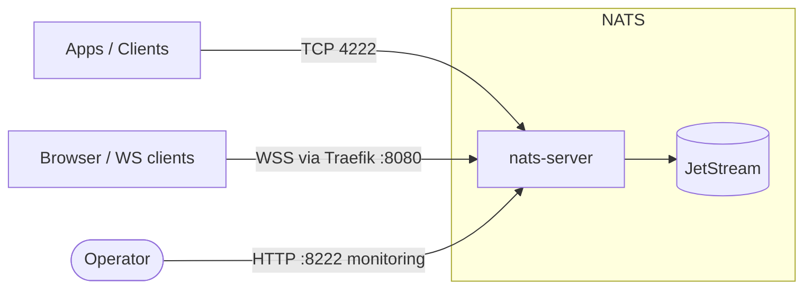

# Dokploy NATS

NATS server with JetStream, token auth, WebSocket, and HTTP monitoring as a single Dokploy Compose service.

## Architecture



## Setup in Dokploy

1. **Create Service → Compose**
   - Provider: Git
   - Repository: this repo (or your fork)
   - Branch: `main`
   - Compose path: `docker-compose.yml`

2. **Environment** — paste `.env.example` into the **Environment** tab and set a strong `NATS_AUTH_TOKEN`:

   ```bash
   openssl rand -hex 32
   ```

3. **Domains** — open the **Domains** tab and add each entry below.

   | Host                         | Path | Service | Container Port |
   | ---------------------------- | ---- | ------- | -------------- |
   | `nats-monitor.<your-domain>` | `/`  | `nats`  | `8222`         |
   | `nats-ws.<your-domain>`      | `/`  | `nats`  | `8080`         |
   - `nats-monitor` exposes `/healthz`, `/varz`, `/connz`, `/jsz`, etc.
   - `nats-ws` is the WebSocket endpoint (`wss://nats-ws.<your-domain>`).

4. **Protect the monitoring endpoint with basic auth** (Traefik middleware)

   **a. Generate a hashed credential**

   ```bash
   htpasswd -nb admin 'password'
   # → admin:$apr1$G3T3XOqn$6JGifVcvveyWFg7gYWZjH0
   ```

   **b. Create the middleware** in Dokploy: go to **Dokploy → Settings → Traefik** and open the dynamic config file editor. Add or append to `middlewares.yml`:

   ```yaml
   http:
     middlewares:
       nats-monitor-auth:
         basicAuth:
           users:
             - "admin:$apr1$G3T3XOqn$6JGifVcvveyWFg7gYWZjH0"
   ```

   **c. Attach it** to the `nats-monitor.<your-domain>` row in the service's **Domains** tab:

   ```
   nats-monitor-auth@file
   ```

5. **Native protocol (port 4222)** — Traefik routes HTTP, not raw TCP. To expose 4222 to outside clients, either:
   - Add `ports: ["4222:4222"]` to the `nats` service and open the firewall, or
   - Use the WebSocket endpoint from clients that support it.

## Commands

Install the NATS CLI: https://github.com/nats-io/natscli

```bash
# context for your deployed instance
nats context save dokploy \
  --server wss://nats-ws.<your-domain> \
  --token "$NATS_AUTH_TOKEN" \
  --select

# basic pub/sub
nats sub demo &
nats pub demo "hello from dokploy"

# JetStream — create stream and publish
nats stream add events --subjects "events.*" --storage file --defaults
nats pub events.user.signup '{"id":"u1"}'
nats stream view events
```

## Extending

All NATS settings are read from `nats.conf` and env vars. To add features:

- **TLS / mTLS** — add a `tls { ... }` block to `nats.conf` and mount certs
- **Cluster / leaf nodes** — add `cluster { ... }` or `leafnodes { ... }` blocks
- **NKey / JWT auth** — replace the `authorization { token: ... }` block with `accounts { ... }` and operator JWT
- **KV / Object store** — managed via `nats` CLI after deploy (`nats kv add`, `nats object add`)

Edit `nats.conf` (env vars referenced as `$VAR`) or `docker-compose.yml`, push, redeploy.

## References

- [Node example](./examples/node) — Fastify UI + worker, request/reply, WebSocket live events, prefix-scoped subscriptions
